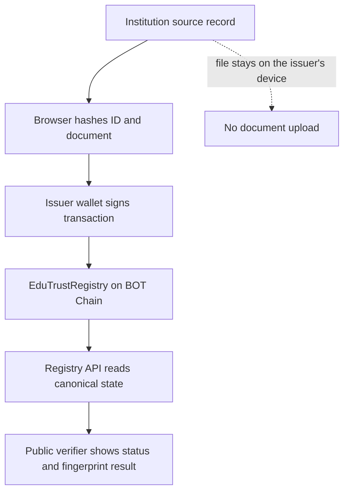

# EduTrust AI

Privacy-preserving academic credential issuance, revocation, and public verification on BOT Chain.

EduTrust AI is a standalone RWA credential-registry MVP for schools, registrars, employers, admissions teams, graduates, and other organisations that need to prove or check an academic credential without publishing the underlying student record. Institutions anchor one-way fingerprints and lifecycle status on-chain; anyone can verify the resulting record without creating an account or contacting the registrar.

> The current MVP uses deterministic cryptographic hashing and BOT Chain as its trust layer. AI/OCR-assisted document extraction is a future extension, not a dependency of the live verification flow.

## Live project

| Resource | Link |
| --- | --- |
| Web application | [edu-trust-ai.vercel.app](https://edu-trust-ai.vercel.app) |
| Institution portal | [edu-trust-ai.vercel.app/dashboard](https://edu-trust-ai.vercel.app/dashboard) |
| Source repository | [github.com/Gentwocoder/EduTrustAI](https://github.com/Gentwocoder/EduTrustAI) |
| BOT Chain developer guide | [dev-docs.botchain.ai](https://dev-docs.botchain.ai/docs/Developers/quick-guide/) |

## The problem

Academic verification is often manual, slow, and fragmented. Employers or admissions teams may wait days for a registrar response, while altered documents can be difficult to distinguish from genuine certificates. Publishing complete student records to a public blockchain would create a different problem: permanent exposure of names, grades, contact details, and files.

EduTrust addresses both sides of that problem:

- the issuing institution remains responsible for the private source record;
- a wallet-authorised issuer registers only cryptographic evidence on BOT Chain;
- the credential can later be marked revoked without deleting its audit history; and
- a verifier receives the contract's canonical status and can optionally compare a document fingerprint.

## Product flows

### 1. Issue a credential

1. An authorised institution opens the issuer workspace and connects an EVM wallet.
2. The issuer selects BOT Chain Mainnet or Testnet, enters the institution-issued credential ID, and selects the source PDF or image.
3. The browser computes a SHA-256 fingerprint of the file locally. The file is never uploaded by the interface.
4. The credential ID is converted to a `bytes32` Keccak-256 hash with `ethers.id`.
5. The wallet signs `issueCredential(credentialIdHash, documentHash)` and pays BOT for gas.
6. The confirmed transaction appears in the wallet's activity view and can be inspected on BOTScan.

### 2. Verify a credential

1. A verifier selects Mainnet or Testnet and enters the credential ID supplied by the institution.
2. The registry API hashes a plaintext ID, or accepts an existing 32-byte hash, and reads `getCredential` from the deployed contract.
3. The interface reports `valid`, `revoked`, or `unknown`, together with the issuer wallet and relevant timestamps.
4. The verifier may also provide a SHA-256 document fingerprint to compare it with the fingerprint registered on-chain.

Public verification is read-only and does not require a wallet, account, or transaction.

### 3. Revoke a credential

1. The original issuer reconnects its wallet and opens a valid record from wallet activity.
2. The issuer enters an internal revocation reason and confirms the warning.
3. The browser hashes the reason locally and submits `revokeCredential(credentialIdHash, reasonHash)`.
4. The contract permanently changes the lifecycle status to `Revoked` and emits a `CredentialRevoked` event.
5. Future public checks return the revoked state and revocation timestamp.

Every revocation caller must have `ISSUER_ROLE`. Within that set, only the original issuer or a wallet that also has `DEFAULT_ADMIN_ROLE` can revoke the credential. The human-readable reason is not sent on-chain or stored by the application.

## How it works



The blockchain is the source of truth for credential existence, issuer, fingerprint, and lifecycle status. Browser storage only preserves human-readable credential labels for the wallet that issued them; activity is reconstructed from `CredentialIssued` events whenever that wallet reconnects.

## Main functions

### Public verifier

- Mainnet/Testnet selector with the most recently selected network retained locally
- Live registry availability check
- Plaintext credential-ID lookup or direct `bytes32` lookup
- Valid, revoked, unknown, and document-mismatch results
- Optional comparison against a supplied SHA-256 fingerprint
- Issuer address, issue date, revocation state, and BOTScan contract link
- No account or wallet required

### Institution portal

- Broad EVM wallet connection through Reown AppKit
- Mainnet/Testnet switching before transaction signing
- Local SHA-256 hashing of PDF and image files
- Wallet-backed credential issuance
- Transaction preview showing chain, issuer, contract, and document fingerprint
- On-chain issuance history restored by wallet and network
- Credential revocation with a locally hashed reason
- Wallet management and explicit disconnection so another wallet can connect
- BOTScan links for contract and transaction inspection

### Registry API

- Contract health and chain-ID reporting
- Canonical credential lookup
- Issuer activity reconstructed from on-chain events
- Current status resolution for issued credentials, including revocations
- Validation for network keys, credential IDs, and issuer addresses
- `502` response when the selected BOT Chain RPC cannot be reached

### Smart contract

- Role-controlled issuance with OpenZeppelin `AccessControl`
- Duplicate, empty-hash, unknown-credential, and repeated-revocation protection
- Permanent status transitions from `Unknown` to `Valid` to `Revoked`
- Public view functions for credential lookup and fingerprint comparison
- Auditable issuance and revocation events

## BOT Chain integration

EduTrust uses BOT Chain as the public integrity and lifecycle layer. It does not mint a token or NFT; native BOT is used only to pay transaction gas.

| Network | Chain ID | Native token | RPC | Explorer | Registry contract |
| --- | ---: | --- | --- | --- | --- |
| Mainnet | `677` | `BOT` | `https://rpc.botchain.ai` | [BOTScan Mainnet](https://scan.botchain.ai) | [`0x49F1...505f`](https://scan.botchain.ai/address/0x49F1D0F56b9d7217fea0C4E0abAf64200b86505f) |
| Testnet | `968` | `BOT` | `https://rpc.bohr.life` | [BOTScan Testnet](https://scan.bohr.life) | [`0x49F1...505f`](https://scan.bohr.life/address/0x49F1D0F56b9d7217fea0C4E0abAf64200b86505f) |

Registry address:

```text
0x49F1D0F56b9d7217fea0C4E0abAf64200b86505f
```

Mainnet deployment transaction:

[`0x107fc9b199a1da8a48df977078cb2045729bd86c4da0106534a7d0d956541dec`](https://scan.botchain.ai/tx/0x107fc9b199a1da8a48df977078cb2045729bd86c4da0106534a7d0d956541dec)

The frontend defaults to Mainnet. The selected network is kept in browser storage, and the wallet is prompted to switch to the corresponding EVM chain before a write transaction.

## On-chain data model

Each credential is stored under a hashed credential ID:

```solidity
struct Credential {
    bytes32 documentHash;
    address issuer;
    uint64 issuedAt;
    uint64 revokedAt;
    CredentialStatus status;
}
```

| Contract item | Purpose |
| --- | --- |
| `DEFAULT_ADMIN_ROLE` | Grants/removes issuer roles and, when the wallet also retains `ISSUER_ROLE`, may revoke any existing credential |
| `ISSUER_ROLE` | Allows an authorised institution wallet to issue credentials |
| `issueCredential(bytes32, bytes32)` | Registers a new credential ID hash and document hash |
| `revokeCredential(bytes32, bytes32)` | Revokes a credential using a hashed private reason |
| `getCredential(bytes32)` | Returns the complete canonical credential state |
| `verifyCredential(bytes32, bytes32)` | Compares a supplied fingerprint and returns status metadata |
| `CredentialIssued` | Records the credential hash, document hash, issuer, and issue time |
| `CredentialRevoked` | Records the credential hash, revoker, reason hash, and revocation time |

The contract is written in Solidity `0.8.28`, uses OpenZeppelin `AccessControl`, and is compiled for the `paris` EVM target required by the current BOT Chain toolchain.

## Privacy and data boundaries

| Location | Data |
| --- | --- |
| BOT Chain | Hashed credential ID, SHA-256 document fingerprint, issuer address, timestamps, status, and hashed revocation reason in the event log |
| Browser memory | Selected source file while its fingerprint is calculated; plaintext revocation reason while the dialog is open |
| Browser local storage | Selected network and wallet/network-scoped activity labels used to restore readable credential IDs |
| Registry API | Transient RPC results returned to the requesting client; no application database writes |
| Never uploaded or written on-chain | Student name, grade, email, contact details, transcript, source PDF/image, and internal registrar notes |

The current MVP has no required application database. Chain state and events are canonical; local storage is a display enhancement, not the credential record.

Hashes are pseudonymous evidence, not encryption. Institutions should still use non-guessable credential identifiers and follow their applicable privacy and records-retention requirements.

## Wallet compatibility

The issuer portal uses Reown AppKit with the ethers adapter and supports EVM externally owned accounts through:

- injected EIP-6963 browser wallets such as MetaMask and Rabby;
- WalletConnect-compatible desktop and mobile wallets via QR/deep link; and
- Coinbase Wallet in EOA mode.

A wallet may connect to the interface, but contract writes succeed only when that wallet has `ISSUER_ROLE` on the selected registry. The wallet also needs enough BOT on the selected network to pay gas.

Email/social login, smart-account abstraction, swaps, on-ramp, send/receive controls, and wallet analytics are intentionally disabled in this MVP.

## Technology stack

| Layer | Technology |
| --- | --- |
| Web application | Next.js 16, React 19, TypeScript |
| UI | Tailwind CSS 4, custom responsive components |
| Wallet connectivity | Reown AppKit, WalletConnect, ethers 6 |
| Registry API | Next.js Route Handler, ethers JSON-RPC provider |
| Smart contract | Solidity 0.8.28, OpenZeppelin AccessControl |
| Contract tooling | Hardhat 3, Mocha, Chai |
| Blockchain | BOT Chain Mainnet and Testnet |
| Production hosting | Vercel |
| Alternate local/worker build | Vinext, Vite, Cloudflare Workers tooling |

## Repository structure

```text
app/
  api/registry/route.ts       BOT Chain read API
  dashboard/page.tsx          institution portal route
  page.tsx                    public verification product page
components/
  issuer-dashboard.tsx        issue, activity, revoke, and wallet controls
  verification-demo.tsx       public verification interface
  network-provider.tsx        selected-network state
  wallet-provider.tsx         Reown AppKit configuration
contracts/
  contracts/EduTrustRegistry.sol
  scripts/deploy.ts            guarded BOT Chain deployment
  test/EduTrustRegistry.ts     contract behaviour tests
docs/
  ARCHITECTURE.md              broader product architecture concept
  DEMO-SCRIPT.md               hackathon demo outline
lib/
  appkit.ts                    EVM chain and wallet definitions
  registry.ts                  registry ABI, address, and network metadata
tests/
  rendered-html.test.mjs       rendered worker smoke test
```

The `db/`, `drizzle/`, `examples/`, and worker-related files are scaffolding for the alternate Sites/Cloudflare runtime. They are not required by the live Vercel MVP and do not currently store credential data.

## Getting started

### Prerequisites

- Node.js `22.13.0` or later
- npm
- An EVM wallet for issuer actions
- Test BOT or Mainnet BOT for contract writes

### Install and run the web application

```bash
git clone https://github.com/Gentwocoder/EduTrustAI.git
cd EduTrustAI
npm ci
cp .env.example .env.local
npm run dev
```

Open the local URL printed by Vite. For direct parity with the Vercel Next.js runtime, use:

```bash
npx next dev
```

The public verifier is available at `/`; the issuer workspace is available at `/dashboard`.

### Environment variables

| Variable | Required | Description |
| --- | --- | --- |
| `NEXT_PUBLIC_REOWN_PROJECT_ID` | No | Public Reown application identifier used for wallet discovery and WalletConnect. A project default is included. |
| `NEXT_PUBLIC_EDUTRUST_REGISTRY_ADDRESS` | No | Overrides the deployed registry address used by both supported networks. |

Both variables are client-visible configuration, not wallet secrets. Never place a private key, seed phrase, or keystore password in a `NEXT_PUBLIC_*` variable.

## Registry API reference

All requests are `GET /api/registry`. If `network` is omitted, Mainnet is used.

### Check registry availability

```http
GET /api/registry?network=mainnet
```

Returns the selected chain ID, network name, registry address, and whether contract bytecode exists at that address.

### Look up a credential

```http
GET /api/registry?network=testnet&credentialId=INSTITUTION-CREDENTIAL-ID
```

`credentialId` may be a plaintext identifier or a 32-byte hexadecimal hash. The response contains:

```json
{
  "credentialIdHash": "0x…",
  "documentHash": "0x…",
  "issuer": "0x…",
  "issuedAt": 0,
  "revokedAt": 0,
  "status": "valid"
}
```

### Load activity for an issuer wallet

```http
GET /api/registry?network=mainnet&issuer=0x...
```

The API queries `CredentialIssued` events for that wallet, then resolves the latest state of each credential through `getCredential`.

## Smart-contract development

### Install, compile, and test

```bash
cd contracts
npm ci
npm run compile
npm test
```

Both Hardhat build profiles are pinned to Solidity `0.8.28` and `evmVersion: "paris"`. If compiler artifacts become stale:

```bash
npx hardhat clean
npm run compile
npx hardhat --build-profile production compile --force
```

### Configure the deployer

The deployment scripts read `BOT_PRIVATE_KEY` from Hardhat's encrypted keystore:

```bash
npx hardhat keystore set BOT_PRIVATE_KEY
```

Hardhat first asks for a keystore password, then for the private key to encrypt. The private key must belong to a funded deployment wallet. Never commit or share the key, seed phrase, or keystore password.

### Deploy to Testnet

1. Add BOT Chain Testnet to the deployment wallet.
2. Obtain test BOT from the [BOT Chain faucet](https://faucet.botchain.ai).
3. Compile and run the contract tests.
4. Deploy:

```bash
npm run deploy:testnet
```

The script refuses to deploy if the connected chain ID is wrong or the deployer has no BOT for gas.

### Deploy to Mainnet

Mainnet deployment is intentionally locked behind an explicit confirmation variable:

```bash
CONFIRM_MAINNET_DEPLOYMENT=yes npm run deploy:mainnet
```

Use real Mainnet BOT only after a successful Testnet rehearsal. The constructor grants both `DEFAULT_ADMIN_ROLE` and `ISSUER_ROLE` to the supplied deployer address.

### Verify a deployment on BOTScan

The constructor argument is the initial administrator wallet. With the included Hardhat chain descriptors:

```bash
npx hardhat verify etherscan \
  --network botTestnet \
  <CONTRACT_ADDRESS> \
  <INITIAL_ADMIN_ADDRESS>

npx hardhat verify etherscan \
  --network botMainnet \
  <CONTRACT_ADDRESS> \
  <INITIAL_ADMIN_ADDRESS>
```

## Validation

### Web application

```bash
npm run lint
npx tsc --noEmit
npx next build
```

The repository also contains a rendered worker smoke test:

```bash
npm test
```

### Smart contract

```bash
cd contracts
npm run compile
npm test
```

The contract tests cover successful issuance and verification, document mismatch detection, revocation, and rejection of unauthorised issuance.

## Deploying the frontend to Vercel

The repository includes `vercel.json` and uses `npx next build` for production.

1. Import `Gentwocoder/EduTrustAI` into Vercel.
2. Keep the framework preset as Next.js and the repository root as the project root.
3. Optionally configure the two public environment variables listed above.
4. Deploy. No database or server-side wallet secret is required.

Changes pushed to the connected production branch can be deployed automatically by Vercel.

## Security considerations

- Never commit a private key, seed phrase, keystore password, or funded-wallet secret.
- Confirm the selected BOT Chain network and registry address in the transaction preview before signing.
- Only wallets granted `ISSUER_ROLE` can issue credentials.
- Revocation requires `ISSUER_ROLE`; the caller must also be the original issuer or hold `DEFAULT_ADMIN_ROLE`.
- Revocation is a permanent status change; the audit history remains on-chain.
- The public API trusts the configured BOT Chain RPC. Production operators may add RPC redundancy, rate limits, monitoring, and caching.
- The contract stores hashes, but low-entropy identifiers can still be guessed and hashed. Institutions should use sufficiently random identifiers.
- This hackathon MVP has not been presented as a third-party security audit.

## Current MVP boundary and roadmap

Working today:

- BOT Chain Mainnet and Testnet registry reads
- wallet-authorised issuance and revocation
- public status and fingerprint verification
- broad EVM wallet connectivity
- wallet-scoped activity restoration from chain events
- Vercel-hosted responsive web interface

Future production extensions:

- institution onboarding, identity verification, and admin UI for role management
- encrypted institutional database and private object storage
- student/graduate delivery portal
- generated credential PDFs, QR verification links, and selective disclosure
- AI/OCR extraction and human-readable document-difference explanations
- bulk issuance, registrar approval workflows, and school-system integrations
- decentralised or redundant RPC/indexing infrastructure
- independent smart-contract audit, operational monitoring, and incident procedures

## Why it is different

EduTrust is designed around a narrow privacy boundary: the public chain proves integrity and lifecycle status, while the institution retains the private academic record. Verification does not depend on an EduTrust user account, a proprietary database entry, or access to the student's original file. The result is portable, independently auditable credential evidence without turning the certificate itself into public blockchain data.

## Additional documentation

- [`contracts/README.md`](contracts/README.md) — detailed contract deployment and secret-handling guide
- [`docs/ARCHITECTURE.md`](docs/ARCHITECTURE.md) — broader target architecture and future service boundaries
- [`docs/DEMO-SCRIPT.md`](docs/DEMO-SCRIPT.md) — hackathon demonstration outline
- [BOT Chain project integration guide](https://dev-docs.botchain.ai/docs/Developers/quick-guide/)
