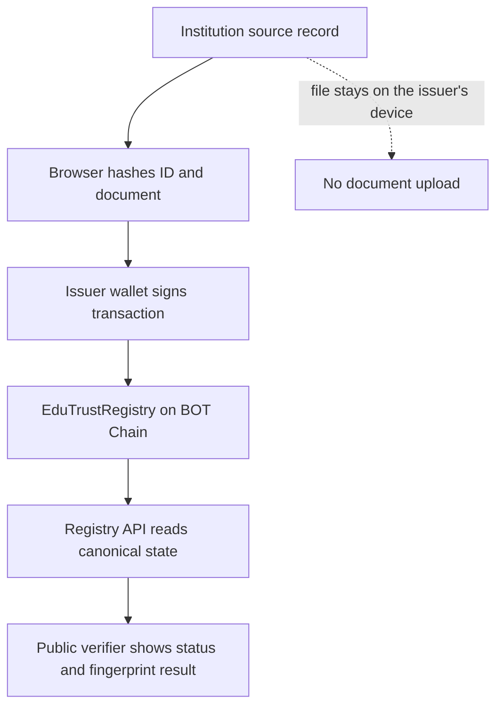

# EduTrust AI

Privacy-preserving academic credential issuance, revocation, and public verification on BOT Chain.

EduTrust AI is a standalone RWA credential-registry MVP for schools, registrars, employers, admissions teams, graduates, and other organisations that need to prove or check an academic credential without publishing the underlying student record. Institutions anchor one-way fingerprints and lifecycle status on-chain; anyone can verify the resulting record without creating an account or contacting the registrar.

> The trust decision remains deterministic: BOT Chain status and cryptographic fingerprints are canonical. An optional browser-only OCR assistant helps registrars inspect visible document fields before issuance, but it cannot issue or authenticate a credential.

## Live project

| Resource | Link |
| --- | --- |
| Web application | [edu-trust-ai.vercel.app](https://edu-trust-ai.vercel.app) |
| Institution portal | [edu-trust-ai.vercel.app/dashboard](https://edu-trust-ai.vercel.app/dashboard) |
| Student credential wallet | [edu-trust-ai.vercel.app/student](https://edu-trust-ai.vercel.app/student) |
| Source repository | [github.com/Gentwocoder/EduTrustAI](https://github.com/Gentwocoder/EduTrustAI) |
| BOT Chain developer guide | [dev-docs.botchain.ai](https://dev-docs.botchain.ai/docs/Developers/quick-guide/) |

## The problem

Academic verification is often manual, slow, and fragmented. Employers or admissions teams may wait days for a registrar response, while altered documents can be difficult to distinguish from genuine certificates. Publishing complete student records to a public blockchain would create a different problem: permanent exposure of names, grades, contact details, and files.

EduTrust addresses both sides of that problem:

- the issuing institution remains responsible for the private source record;
- a wallet-authorised issuer registers only cryptographic evidence on BOT Chain;
- the credential can later be marked revoked without deleting its audit history; and
- a verifier receives the contract's canonical status and can optionally compare a document fingerprint.

## Product flows

### 1. Issue a credential

1. An authorised institution opens the issuer workspace and connects an EVM wallet.
2. The issuer selects BOT Chain Mainnet or Testnet, enters the institution-issued credential ID, and selects the source PDF or image.
3. The browser computes a SHA-256 fingerprint of the file locally. The file is never uploaded by the interface.
4. The issuer may run a private OCR review that checks visible IDs, dates, institution names, qualification text, and placeholder language entirely in the browser.
5. A human reviews the findings and decides whether to continue.
6. The credential ID is converted to a `bytes32` Keccak-256 hash with `ethers.id`.
7. The wallet signs `issueCredential(credentialIdHash, documentHash)` and pays BOT for gas.
8. The confirmed transaction appears in the wallet's activity view and can be inspected on BOTScan.

### 2. Verify a credential

1. A verifier selects Mainnet or Testnet and enters the credential ID supplied by the institution.
2. The registry API hashes a plaintext ID, or accepts an existing 32-byte hash, and reads `getCredential` from the deployed contract.
3. The interface reports `valid`, `revoked`, or `unknown`, together with the issuer wallet and relevant timestamps.
4. The verifier may also provide a SHA-256 document fingerprint to compare it with the fingerprint registered on-chain.

Public verification is read-only and does not require a wallet, account, or transaction.

### Credential, document, and transaction hashes

These three values serve different purposes:

| Value | Algorithm/source | Purpose |
| --- | --- | --- |
| Credential ID hash | Keccak-256 via `ethers.id(credentialId)` | Registry key used by the contract, API lookup, and QR verification route |
| Document hash | SHA-256 of the selected source file | Lets a verifier check whether a specific file matches the issued record |
| Transaction hash | Returned by BOT Chain after a signed write | Opens the issuance or revocation transaction on BOTScan; it is not the credential lookup key |

A QR route such as `/verify/testnet/0x...` therefore contains the credential ID hash, not the deployment or issuance transaction hash.

### 3. Revoke a credential

1. The original issuer reconnects its wallet and opens a valid record from wallet activity.
2. The issuer enters an internal revocation reason and confirms the warning.
3. The browser hashes the reason locally and submits `revokeCredential(credentialIdHash, reasonHash)`.
4. The contract permanently changes the lifecycle status to `Revoked` and emits a `CredentialRevoked` event.
5. Future public checks return the revoked state and revocation timestamp.

Every revocation caller must have `ISSUER_ROLE`. Within that set, only the original issuer or a wallet that also has `DEFAULT_ADMIN_ROLE` can revoke the credential. The human-readable reason is not sent on-chain or stored by the application.


### Private document review

The single-credential issuance form includes an optional local review. When the issuer starts it:

1. Text-based PDFs are read directly in the browser.
2. Scanned PDF pages and images are processed with browser-side OCR.
3. EduTrust checks for the entered credential ID, an institution name, a qualification, an issue date, and obvious placeholder/editing language.
4. The interface returns advisory findings and an OCR confidence score.
5. An authorised human decides whether to issue the record.

For performance, PDF review is limited to the first three pages and files up to 12 MB. Large images are downscaled to a maximum dimension of 2,200 pixels and enhanced locally before recognition. English is the current OCR language.

The OCR/PDF runtimes and compact English model are loaded on demand from pinned jsDelivr packages. The interface advances through visible loading stages, allows up to 45 seconds for OCR startup, and limits recognition to 90 seconds. Engine download requests time out after 15 seconds instead of leaving the review indefinitely at 0%.

No document or extracted text is sent to an EduTrust API, database, blockchain, or AI provider. The review result is advisory and remains subject to human approval. If the browser cannot load the OCR engine—or the document is difficult to read—issuance still supports manual review and local SHA-256 hashing.

### 4. Share or bulk issue credentials

Each activity row can generate a QR code containing a public route in the form `/verify/{network}/{credentialIdHash}`. The route selects the correct BOT Chain network and performs the registry lookup automatically. The QR contains no document, student name, grade, or contact information. QuickChart renders the QR image and receives only this already-public verification URL—never the source document, extracted text, or student data.

For batches, upload a CSV with this header:

```csv
credentialId,documentHash
```

The institution portal validates the rows and submits them sequentially. Each row is an independent wallet transaction, so confirmed credentials are not repeated when another row fails.

### Student credential wallet and controlled links

Recipients can connect an EVM wallet at `/student`, add an institution-issued credential ID, and keep the resulting public registry reference in a browser collection scoped to that wallet address. Only the hashed ID and public registry metadata are persisted; the plaintext credential ID is not retained.

A saved credential can produce a wallet-signed link lasting 1, 7, or 30 days. The link identifies the presenting wallet, selects the correct BOT Chain network, and stops rendering the credential after expiry. It does not require gas or an on-chain transaction. Because the deployed V1 schema does not bind credentials to recipient addresses, the signature is evidence of who presented the link—not proof that the wallet owner is the student named in a private source record. MVP links cannot be revoked before their expiry.

### Downloadable verification receipts

Every successful public verification can export a locally generated PDF containing the observed status, institution and issuer wallet, document-match result, network and chain ID, registry contract, issuance transaction, issue/expiry timestamps, replacement pointer, and verification timestamp. The PDF is generated in the browser without uploading verification data to a receipt service. It is a point-in-time report; verifiers should re-check the live registry before making a later decision.

### Expiry, renewal, correction, and admin recovery

These lifecycle writes are implemented in `EduTrustRegistryV2`, which is deployment-ready but not retrofitted into the immutable live V1 contract. V2 preserves the V1 read shape and adds optional expiry, explicit renewal/correction replacement links, and two-step primary-administrator rotation.

The V2 recovery role should be assigned to a reviewed Safe or other EVM multisig. The multisig proposes a replacement administrator and the proposed wallet accepts; acceptance removes administrator and issuer roles from the previous primary wallet. The application detects the registry version and disables only V2 write controls while a network still points to V1.

### Verified institution profiles

The verifier always displays the canonical issuer wallet. When that wallet also has a reviewed EduTrust profile, the response adds the institution name, category, website, country, and verification basis. Profile metadata is server-side configuration; holding `ISSUER_ROLE` alone does not permit a wallet to invent a verified organisation name.

## How it works



The blockchain is the source of truth for credential existence, issuer, fingerprint, and lifecycle status. Browser storage only preserves human-readable credential labels for the wallet that issued them; activity is reconstructed from `CredentialIssued` events whenever that wallet reconnects.

## Main functions

### Public verifier

- Mainnet/Testnet selector with the most recently selected network retained locally
- Live registry availability check
- Plaintext credential-ID lookup or direct `bytes32` lookup
- Valid, revoked, unknown, and document-mismatch results
- Optional comparison against a supplied SHA-256 fingerprint
- Verified institution name and category when the issuer has a reviewed profile
- Issuer address, issue date, revocation state, and BOTScan contract link
- QR deep links that select the correct BOT Chain network and verify immediately
- Locally generated PDF verification receipts with transaction and timestamp evidence
- No account or wallet required

### Student credential wallet

- Wallet-scoped local collection containing only public credential hashes and registry metadata
- Live refresh of valid, revoked, expired, or replaced status
- Wallet-signed verification links with 1, 7, or 30 day expiry
- Clear presenter-versus-owner disclosure
- PDF receipt export for saved credentials
- Explicit credential removal and wallet disconnection

### Institution portal

- Broad EVM wallet connection through Reown AppKit
- Mainnet/Testnet switching before transaction signing
- Local SHA-256 hashing of PDF and image files
- Private browser-only OCR review with human-readable pre-issuance findings
- Wallet-backed credential issuance
- CSV bulk issuance for up to 100 prepared credential/document fingerprints
- Transaction preview showing chain, issuer, contract, and document fingerprint
- On-chain issuance history restored by wallet and network
- Credential revocation with a locally hashed reason
- Wallet management and explicit disconnection so another wallet can connect
- QR code and shareable verification link for every issued record
- Optional expiry during issuance when Registry V2 is active
- Dedicated renewal, correction, and administrator recovery workspace
- BOTScan links for contract and transaction inspection

### Registry API

- Contract health and chain-ID reporting
- Canonical credential lookup
- Issuer activity reconstructed from on-chain events
- Current status resolution for issued credentials, including revocations, expiry, and replacement
- Registry-version detection and issuance-transaction lookup
- Verified institution profile resolution for known issuer wallets
- Validation for network keys, credential IDs, and issuer addresses
- `502` response when the selected BOT Chain RPC cannot be reached

### Smart contracts

- Deployed V1 registry with role-controlled issuance and revocation
- Deployment-ready V2 registry with V1-compatible reads
- Optional expiry and explicit `Renewed`, `Corrected`, and `Replaced` lifecycle semantics
- Two-step administrator rotation through a separately protected recovery role
- Duplicate, empty-hash, unknown-credential, repeated-revocation, invalid-expiry, and inactive-replacement protection
- Auditable issuance, revocation, replacement, and administration events

## BOT Chain integration

EduTrust uses BOT Chain as the public integrity and lifecycle layer. It does not mint a token or NFT; native BOT is used only to pay transaction gas.

| Network | Chain ID | Native token | RPC | Explorer | Registry contract |
| --- | ---: | --- | --- | --- | --- |
| Mainnet | `677` | `BOT` | `https://rpc.botchain.ai` | [BOTScan Mainnet](https://scan.botchain.ai) | [`0x49F1...505f`](https://scan.botchain.ai/address/0x49F1D0F56b9d7217fea0C4E0abAf64200b86505f) |
| Testnet | `968` | `BOT` | `https://rpc.bohr.life` | [BOTScan Testnet](https://scan.bohr.life) | [`0x49F1...505f`](https://scan.bohr.life/address/0x49F1D0F56b9d7217fea0C4E0abAf64200b86505f) |

Registry address:

```text
0x49F1D0F56b9d7217fea0C4E0abAf64200b86505f
```

Mainnet deployment transaction:

[`0x107fc9b199a1da8a48df977078cb2045729bd86c4da0106534a7d0d956541dec`](https://scan.botchain.ai/tx/0x107fc9b199a1da8a48df977078cb2045729bd86c4da0106534a7d0d956541dec)

The frontend defaults to Mainnet. The selected network is kept in browser storage, and the wallet is prompted to switch to the corresponding EVM chain before a write transaction.

The addresses above are the deployed V1 registries. V2 is included in source but requires a separate Testnet deployment and review before either network-specific frontend address is changed. Existing V1 records remain at the V1 address and are not migrated automatically.

## On-chain data model

Each credential is stored under a hashed credential ID:

```solidity
struct Credential {
    bytes32 documentHash;
    address issuer;
    uint64 issuedAt;
    uint64 revokedAt;
    CredentialStatus status;
}
```

| Contract item | Purpose |
| --- | --- |
| `DEFAULT_ADMIN_ROLE` | Grants/removes issuer roles and, when the wallet also retains `ISSUER_ROLE`, may revoke any existing credential |
| `ISSUER_ROLE` | Allows an authorised institution wallet to issue credentials |
| `issueCredential(bytes32, bytes32)` | Registers a new credential ID hash and document hash |
| `revokeCredential(bytes32, bytes32)` | Revokes a credential using a hashed private reason |
| `getCredential(bytes32)` | Returns the complete canonical credential state |
| `verifyCredential(bytes32, bytes32)` | Compares a supplied fingerprint and returns status metadata |
| `CredentialIssued` | Records the credential hash, document hash, issuer, and issue time |
| `CredentialRevoked` | Records the credential hash, revoker, reason hash, and revocation time |

Both registry versions are written in Solidity `0.8.28`, use OpenZeppelin `AccessControl`, and compile for the `paris` EVM target required by the current BOT Chain toolchain. V2 adds `expiresAt`, `supersedes`, and `replacement` lifecycle fields while retaining the original five-field read order.

## Privacy and data boundaries

| Location | Data |
| --- | --- |
| BOT Chain | Hashed credential ID, SHA-256 document fingerprint, issuer address, timestamps, status, and hashed revocation reason in the event log |
| Browser memory | Selected source file and temporary extracted OCR text while the review is open; plaintext revocation reason while the dialog is open |
| Browser local storage | Selected network, issuer activity labels, and student-wallet collections scoped by wallet address; the student wallet stores the public credential hash rather than the entered plaintext ID |
| Registry API | Transient RPC results returned to the requesting client; no application database writes |
| Never uploaded or written on-chain | Student name, grade, email, contact details, transcript, source PDF/image, extracted OCR text, and internal registrar notes |

The current MVP has no required application database. Chain state and events are canonical; local storage is a display enhancement, not the credential record.

Hashes are pseudonymous evidence, not encryption. Institutions should still use non-guessable credential identifiers and follow their applicable privacy and records-retention requirements.

## Wallet compatibility

The issuer portal uses Reown AppKit with the ethers adapter and supports EVM externally owned accounts through:

- injected EIP-6963 browser wallets such as MetaMask and Rabby;
- WalletConnect-compatible desktop and mobile wallets via QR/deep link; and
- Coinbase Wallet in EOA mode.

A wallet may connect to the interface, but contract writes succeed only when that wallet has `ISSUER_ROLE` on the selected registry. The wallet also needs enough BOT on the selected network to pay gas.

Email/social login, smart-account abstraction, swaps, on-ramp, send/receive controls, and wallet analytics are intentionally disabled in this MVP.

## Technology stack

| Layer | Technology |
| --- | --- |
| Web application | Next.js 16, React 19, TypeScript |
| UI | Tailwind CSS 4, custom responsive components |
| Private document review | Pinned Tesseract.js 7, compact English OCR data, and PDF.js 6 loaded on demand in the browser |
| Wallet connectivity | Reown AppKit, WalletConnect, ethers 6 |
| Registry API | Next.js Route Handler, ethers JSON-RPC provider |
| Smart contract | Solidity 0.8.28, OpenZeppelin AccessControl |
| Contract tooling | Hardhat 3, Mocha, Chai |
| Blockchain | BOT Chain Mainnet and Testnet |
| Production hosting | Vercel |
| Alternate local/worker build | Vinext, Vite, Cloudflare Workers tooling |

## Repository structure

```text
app/
  api/registry/route.ts            BOT Chain read API
  dashboard/page.tsx               institution portal route
  dashboard/lifecycle/page.tsx     V2 lifecycle and recovery workspace
  student/page.tsx                 recipient credential wallet
  share/[token]/page.tsx           wallet-signed time-limited presentation
  verify/[network]/[credential]/   QR/deep-link verification route
  page.tsx                         public verification product page
components/
  issuer-dashboard.tsx             issue, activity, revoke, and wallet controls
  bulk-issuance.tsx                CSV validation and sequential batch issuance
  credential-qr.tsx                privacy-bounded QR sharing dialog
  local-document-review.tsx        browser-only PDF extraction and OCR review
  student-credential-wallet.tsx    recipient collection and controlled sharing
  lifecycle-manager.tsx            renewal, correction, and admin rotation
  verification-demo.tsx            public verification interface
  network-provider.tsx             selected-network state
  wallet-provider.tsx              Reown AppKit configuration
contracts/
  contracts/EduTrustRegistry.sol
  contracts/EduTrustRegistryV2.sol
  scripts/deploy.ts                 guarded V1 BOT Chain deployment
  scripts/deploy-v2.ts              guarded V2 deployment with recovery admin
  test/EduTrustRegistry.ts          contract behaviour tests
docs/
  ARCHITECTURE.md                   broader product architecture concept
  DEMO-SCRIPT.md                    hackathon demo outline
lib/
  appkit.ts                         EVM chain and wallet definitions
  credential-share.ts               wallet-signed presentation tokens
  institutions.ts                   reviewed issuer-profile resolution
  registry.ts                       registry ABI, address, and network metadata
tests/
  rendered-html.test.mjs            rendered worker smoke test
```

The `db/`, `drizzle/`, `examples/`, and worker-related files are scaffolding for the alternate Sites/Cloudflare runtime. They are not required by the live Vercel MVP and do not currently store credential data.

## Getting started

### Prerequisites

- Node.js `22.13.0` or later
- npm
- An EVM wallet for issuer actions
- Test BOT or Mainnet BOT for contract writes

### Install and run the web application

```bash
git clone https://github.com/Gentwocoder/EduTrustAI.git
cd EduTrustAI
npm ci
cp .env.example .env.local
npm run dev
```

Open the local URL printed by Vite. For direct parity with the Vercel Next.js runtime, use:

```bash
npx next dev
```

The public verifier is available at `/`; the issuer workspace is available at `/dashboard`.

### Environment variables

| Variable | Required | Description |
| --- | --- | --- |
| `NEXT_PUBLIC_REOWN_PROJECT_ID` | No | Public Reown application identifier used for wallet discovery and WalletConnect. A project default is included. |
| `NEXT_PUBLIC_EDUTRUST_REGISTRY_ADDRESS` | No | Legacy shared registry override used when network-specific values are absent. |
| `NEXT_PUBLIC_EDUTRUST_MAINNET_REGISTRY_ADDRESS` | No | Mainnet-only registry override, used to activate a separately deployed V2 contract. |
| `NEXT_PUBLIC_EDUTRUST_TESTNET_REGISTRY_ADDRESS` | No | Testnet-only registry override, used to rehearse V2 without changing Mainnet. |
| `EDUTRUST_INSTITUTION_PROFILES_JSON` | No | Server-only JSON array of reviewed institution profiles keyed by issuer wallet. |

All `NEXT_PUBLIC_` variables are client-visible configuration, not wallet secrets. `EDUTRUST_INSTITUTION_PROFILES_JSON` is server-only and must not use the `NEXT_PUBLIC_` prefix. Never place a private key, seed phrase, or keystore password in a public variable.

## Registry API reference

All requests are `GET /api/registry`. If `network` is omitted, Mainnet is used.

### Check registry availability

```http
GET /api/registry?network=mainnet
```

Returns the selected chain ID, network name, registry address, detected contract version, and whether contract bytecode exists at that address. Credential responses also include the issuance transaction and V2 lifecycle fields when available.

### Look up a credential

```http
GET /api/registry?network=testnet&credentialId=INSTITUTION-CREDENTIAL-ID
```

`credentialId` may be a plaintext identifier or a 32-byte hexadecimal hash. The response contains:

```json
{
  "credentialIdHash": "0x…",
  "documentHash": "0x…",
  "issuer": "0x…",
  "issuedAt": 0,
  "revokedAt": 0,
  "status": "valid"
}
```

### Load activity for an issuer wallet

```http
GET /api/registry?network=mainnet&issuer=0x...
```

The API queries `CredentialIssued` events for that wallet, then resolves the latest state of each credential through `getCredential`.

## Smart-contract development

### Install, compile, and test

```bash
cd contracts
npm ci
npm run compile
npm test
```

Both Hardhat build profiles are pinned to Solidity `0.8.28` and `evmVersion: "paris"`. If compiler artifacts become stale:

```bash
npx hardhat clean
npm run compile
npx hardhat --build-profile production compile --force
```

### Configure the deployer

The deployment scripts read `BOT_PRIVATE_KEY` from Hardhat's encrypted keystore:

```bash
npx hardhat keystore set BOT_PRIVATE_KEY
```

Hardhat first asks for a keystore password, then for the private key to encrypt. The private key must belong to a funded deployment wallet. Never commit or share the key, seed phrase, or keystore password.

### Deploy to Testnet

1. Add BOT Chain Testnet to the deployment wallet.
2. Obtain test BOT from the [BOT Chain faucet](https://faucet.botchain.ai).
3. Compile and run the contract tests.
4. Deploy:

```bash
npm run deploy:testnet
```

The script refuses to deploy if the connected chain ID is wrong or the deployer has no BOT for gas.

### Deploy Registry V2 to Testnet

Set a recovery administrator. For production this should be a separately controlled Safe or other reviewed EVM multisig.

```bash
EDUTRUST_RECOVERY_ADMIN=0x... npm run deploy:v2:testnet
```

After verification, set `NEXT_PUBLIC_EDUTRUST_TESTNET_REGISTRY_ADDRESS` to the new address. The Mainnet frontend can continue reading V1 independently.

### Deploy to Mainnet

Mainnet deployment is intentionally locked behind an explicit confirmation variable:

```bash
CONFIRM_MAINNET_DEPLOYMENT=yes npm run deploy:mainnet
```

Use real Mainnet BOT only after a successful Testnet rehearsal. The V1 constructor grants both `DEFAULT_ADMIN_ROLE` and `ISSUER_ROLE` to the supplied deployer address.

V2 Mainnet deployment additionally requires a separate recovery address:

```bash
EDUTRUST_RECOVERY_ADMIN=0x... \
CONFIRM_MAINNET_DEPLOYMENT=yes \
npm run deploy:v2:mainnet
```

### Verify a deployment on BOTScan

The constructor argument is the initial administrator wallet. With the included Hardhat chain descriptors:

```bash
npx hardhat verify etherscan \
  --network botTestnet \
  <CONTRACT_ADDRESS> \
  <INITIAL_ADMIN_ADDRESS>

npx hardhat verify etherscan \
  --network botMainnet \
  <CONTRACT_ADDRESS> \
  <INITIAL_ADMIN_ADDRESS>
```

## Validation

### Web application

```bash
npm run lint
npx tsc --noEmit
npx next build
```

The repository also contains a rendered worker smoke test:

```bash
npm test
```

### Smart contract

```bash
cd contracts
npm run compile
npm test
```

The contract tests cover successful issuance and verification, document mismatch detection, revocation, and rejection of unauthorised issuance.

## Deploying the frontend to Vercel

The repository includes `vercel.json` and uses `npx next build` for production.

1. Import `Gentwocoder/EduTrustAI` into Vercel.
2. Keep the framework preset as Next.js and the repository root as the project root.
3. Optionally configure the two public environment variables listed above.
4. Deploy. No database or server-side wallet secret is required.

Changes pushed to the connected production branch can be deployed automatically by Vercel.

## Security considerations

- Never commit a private key, seed phrase, keystore password, or funded-wallet secret.
- Private OCR is advisory. It does not prove authenticity, replace registrar approval, or change the canonical on-chain verification result.
- OCR and PDF engine code/language data are downloaded on demand from pinned jsDelivr versions; QuickChart receives only the public verification URL when rendering a QR. Documents and extracted text are never transmitted.
- Confirm the selected BOT Chain network and registry address in the transaction preview before signing.
- Only wallets granted `ISSUER_ROLE` can issue credentials.
- Revocation requires `ISSUER_ROLE`; the caller must also be the original issuer or hold `DEFAULT_ADMIN_ROLE`.
- Revocation is a permanent status change; the audit history remains on-chain.
- Controlled share links are public to anyone who receives the URL, expire after at most 30 days, and cannot be revoked early in this MVP.
- A presenter signature does not prove student ownership because recipient wallets are not stored in V1 or V2.
- Verification receipts are point-in-time reports, not substitutes for a fresh registry check.
- V2 recovery should be assigned to a separately reviewed multisig; never use the same single key for both primary administration and recovery.
- The public API trusts the configured BOT Chain RPC. Production operators may add RPC redundancy, rate limits, monitoring, and caching.
- The contract stores hashes, but low-entropy identifiers can still be guessed and hashed. Institutions should use sufficiently random identifiers.
- This hackathon MVP has not been presented as a third-party security audit.

## Current MVP boundary and roadmap

Working today:

- verified institution profile resolution for reviewed issuer wallets
- QR verification links that preserve the credential hash and network
- CSV bulk issuance with per-row progress and retryable failures
- private OCR-assisted review before single credential issuance
- BOT Chain Mainnet and Testnet registry reads
- wallet-authorised issuance and revocation
- public status and fingerprint verification
- broad EVM wallet connectivity
- wallet-scoped activity restoration from chain events
- student credential collection with wallet-signed, time-limited presentation links
- downloadable local PDF verification receipts
- V2-ready expiry, renewal, correction, and administrator recovery interfaces
- Vercel-hosted responsive web interface

Future production extensions:

- self-service institution onboarding and evidence review
- encrypted institutional database and private object storage
- authenticated cross-device student delivery and early share-link revocation
- institution-issued recipient binding and selective disclosure
- multilingual OCR packs, offline-bundled OCR assets, and advanced local document-difference explanations
- registrar approval workflows and school-system integrations
- decentralised or redundant RPC/indexing infrastructure
- V2 Testnet deployment, independent smart-contract audit, multisig rehearsal, operational monitoring, and incident procedures

## Why it is different

EduTrust is designed around a narrow privacy boundary: the public chain proves integrity and lifecycle status, while the institution retains the private academic record. Verification does not depend on an EduTrust user account, a proprietary database entry, or access to the student's original file. The result is portable, independently auditable credential evidence without turning the certificate itself into public blockchain data.

## Additional documentation

- [`contracts/README.md`](contracts/README.md) — detailed contract deployment and secret-handling guide
- [`docs/ARCHITECTURE.md`](docs/ARCHITECTURE.md) — broader target architecture and future service boundaries
- [`docs/DEMO-SCRIPT.md`](docs/DEMO-SCRIPT.md) — hackathon demonstration outline
- [BOT Chain project integration guide](https://dev-docs.botchain.ai/docs/Developers/quick-guide/)
